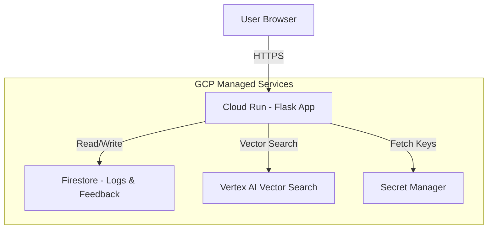

# Master GCP Migration Guide: Change Management Chatbot

This document contains **everything** required to migrate your application to Google Cloud Platform. It includes the architecture, detailed infrastructure setup (with scripts), code changes, and deployment steps.

---

# 🏗️ Architecture

The application moves from a local Flask app to a serverless, cloud-native architecture.



---

# PART 1: GCP Infrastructure Setup

Perform these steps in the **Google Cloud Console** or **Cloud Shell**.

### 1. Project & APIs
```bash
# 1. Create Project
gcloud projects create change-bot-prod --name="Change Management Bot"
gcloud config set project change-bot-prod

# 2. Enable APIs
gcloud services enable run.googleapis.com \
                       firestore.googleapis.com \
                       secretmanager.googleapis.com \
                       aiplatform.googleapis.com \
                       storage.googleapis.com \
                       cloudbuild.googleapis.com
```

### 2. Database (Firestore)
*Replaces local CSV files for logging.*
1.  Go to **Firestore** in Console.
2.  Click **Create Database**.
3.  Select **Native Mode**.
4.  Choose Region: `us-central1`.

### 3. Vector Search (Vertex AI)
*Replaces local ChromaDB.*

**Step A: Create Storage Bucket**
```bash
gcloud storage buckets create gs://change-bot-vectors-$(gcloud config get-value project) --location=us-central1
```

**Step B: Generate & Upload Initial Data**
Create a script `scripts/prepare_vertex_data.py` locally to convert your PDFs:
```python
import json
import os
from langchain_community.document_loaders import PyPDFDirectoryLoader
from langchain_text_splitters import RecursiveCharacterTextSplitter
from langchain_google_genai import GoogleGenerativeAIEmbeddings

# Ensure GOOGLE_API_KEY is set in your environment
# os.environ["GOOGLE_API_KEY"] = "YOUR_KEY"

def generate_jsonl():
    print("Loading PDFs...")
    loader = PyPDFDirectoryLoader("docs")
    docs = loader.load()
    
    splitter = RecursiveCharacterTextSplitter(chunk_size=500, chunk_overlap=100)
    chunks = splitter.split_documents(docs)
    
    print(f"Generating embeddings for {len(chunks)} chunks...")
    embeddings = GoogleGenerativeAIEmbeddings(model="models/text-embedding-004")
    
    output_file = "vectors.jsonl"
    with open(output_file, "w") as f:
        for i, chunk in enumerate(chunks):
            vector = embeddings.embed_query(chunk.page_content)
            record = {"id": str(i), "embedding": vector}
            f.write(json.dumps(record) + "\n")
            
    print(f"Done! Saved to {output_file}")

if __name__ == "__main__":
    generate_jsonl()
```
Run it and upload:
```bash
python scripts/prepare_vertex_data.py
gcloud storage cp vectors.jsonl gs://change-bot-vectors-$(gcloud config get-value project)/init/
```

**Step C: Create Index & Endpoint**
1.  Go to **Vertex AI > Vector Search**.
2.  **Create Index**:
    - Name: `change-bot-index`
    - Dimensions: `768`
    - Update Method: `Stream Update`
3.  **Create Endpoint**: Name it `change-bot-endpoint`.
4.  **Deploy Index**: Deploy the index to the endpoint.
    - **IMPORTANT**: Copy the `INDEX_ID` and `ENDPOINT_ID`.

### 4. Secrets (Secret Manager)
*Replaces .env file.*
```bash
echo -n "YOUR_FLASK_SECRET" | gcloud secrets create flask-secret-key --data-file=-
echo -n "YOUR_GOOGLE_API_KEY" | gcloud secrets create google-api-key --data-file=-
echo -n "YOUR_SERVICENOW_PASSWORD" | gcloud secrets create servicenow-password --data-file=-
```

### 5. Permissions (IAM)
Grant the Cloud Run service account access.
```bash
$PN = gcloud projects describe $(gcloud config get-value project) --format="value(projectNumber)"
$SA = "$PN-compute@developer.gserviceaccount.com"

gcloud projects add-iam-policy-binding $(gcloud config get-value project) --member="serviceAccount:$SA" --role="roles/datastore.user"
gcloud projects add-iam-policy-binding $(gcloud config get-value project) --member="serviceAccount:$SA" --role="roles/aiplatform.user"
gcloud projects add-iam-policy-binding $(gcloud config get-value project) --member="serviceAccount:$SA" --role="roles/secretmanager.secretAccessor"
```

---

# PART 2: Code Changes

Modify your local code to use these services.

### 1. `requirements.txt`
**Action**: Append these lines to the end of the file.
```text
google-cloud-firestore==2.14.0
google-cloud-secret-manager==2.18.0
langchain-google-vertexai==0.0.5
```

### 2. `app/services/logging_service.py` (Firestore)
**Action**: Replace CSV logging with Firestore.

**A. Imports (Lines 1-5)**
Add `from google.cloud import firestore` and initialize the client.
```python
import os
import csv
import datetime
from google.cloud import firestore  # [NEW]
from app.config import Config

# [NEW] Initialize Firestore
try:
    db = firestore.Client()
except:
    db = None
```

**B. `log_interaction` (Replace Lines 28-43)**
```python
    # ... (keep lines 6-27) ...
    timestamp = datetime.datetime.now().strftime("%Y-%m-%d %H:%M:%S")
    
    # [REPLACE CSV LOGIC WITH THIS]
    if db:
        try:
            db.collection('query_logs').add({
                "timestamp": timestamp,
                "question": question,
                "answer": answer,
                "status": status
            })
        except Exception as e:
            print(f"Firestore Log Error: {e}")
```

**C. `log_feedback` (Replace Lines 49-55)**
```python
    # ... (keep lines 47-48) ...
    # [REPLACE CSV LOGIC WITH THIS]
    if db:
        try:
            db.collection('feedback_logs').add({
                "timestamp": timestamp,
                "type": feedback_type,
                "message": message_content
            })
        except Exception as e:
            print(f"Firestore Feedback Error: {e}")
```

**D. `log_escalation` (Replace Lines 61-66)**
```python
    # ... (keep lines 59-60) ...
    # [REPLACE CSV LOGIC WITH THIS]
    if db:
        try:
            db.collection('escalation_logs').add({
                "timestamp": timestamp,
                "reason": reason,
                "chat_history": str(chat_history) # Store as string or structured data
            })
        except Exception as e:
            print(f"Firestore Escalation Error: {e}")
```

### 3. `app/services/rag_service.py` (Vertex AI)
**Action**: Replace ChromaDB with Vertex AI.

**A. Imports (Lines 1-12)**
Replace `from langchain_community.vectorstores import Chroma` with:
```python
from langchain_google_vertexai import VectorSearchVectorStore
from langchain_google_genai import GoogleGenerativeAIEmbeddings
```

**B. `initialize_rag_chain` (Replace Lines 35-37)**
```python
        # ... (keep lines 19-34) ...
        embeddings = GoogleGenerativeAIEmbeddings(model="models/text-embedding-004")
        
        # [REPLACE CHROMA SETUP WITH THIS]
        # Use IDs from Part 1, Step 3
        vectorstore = VectorSearchVectorStore.from_components(
            project_id="YOUR_PROJECT_ID",
            region="us-central1",
            gcs_bucket_name="gs://YOUR_BUCKET_NAME",
            index_id="YOUR_INDEX_ID",     
            endpoint_id="YOUR_ENDPOINT_ID", 
            embedding=embeddings
        )
        
        retriever = vectorstore.as_retriever()
        # ... (rest of function) ...
```

### 4. `app/routes.py` (Analytics)
**Action**: Update Analytics to read from Firestore instead of CSVs.

**`analytics` function (Replace Lines 360-412)**
Replace the file reading blocks for `Config.LOG_FILE`, `Config.FEEDBACK_FILE`, and `Config.ESCALATION_FILE` with Firestore queries.

```python
    # ... inside analytics() function ...
    
    # [REPLACE CSV READING LOGIC]
    if db:
        # 1. Fetch Query Logs
        docs = db.collection('query_logs').order_by('timestamp', direction=firestore.Query.DESCENDING).limit(50).stream()
        for doc in docs:
            data = doc.to_dict()
            logs.append(data)
            # ... (add logic to populate daily_volume, status_counts etc. from 'data') ...

        # 2. Fetch Feedback
        fb_docs = db.collection('feedback_logs').order_by('timestamp', direction=firestore.Query.DESCENDING).limit(10).stream()
        for doc in fb_docs:
            recent_feedback.append(doc.to_dict())

        # 3. Fetch Escalations
        esc_docs = db.collection('escalation_logs').order_by('timestamp', direction=firestore.Query.DESCENDING).limit(10).stream()
        for doc in esc_docs:
            escalations.append(doc.to_dict())
```

---

# PART 3: Deploy

Deploy the application to Cloud Run.

```bash
gcloud run deploy change-bot \
  --source . \
  --platform managed \
  --region us-central1 \
  --allow-unauthenticated \
  --set-env-vars="SERVICENOW_INSTANCE=https://your-instance.service-now.com,SERVICENOW_USER=admin" \
  --set-secrets="SECRET_KEY=flask-secret-key:latest,GOOGLE_API_KEY=google-api-key:latest,SERVICENOW_PASSWORD=servicenow-password:latest"
```
